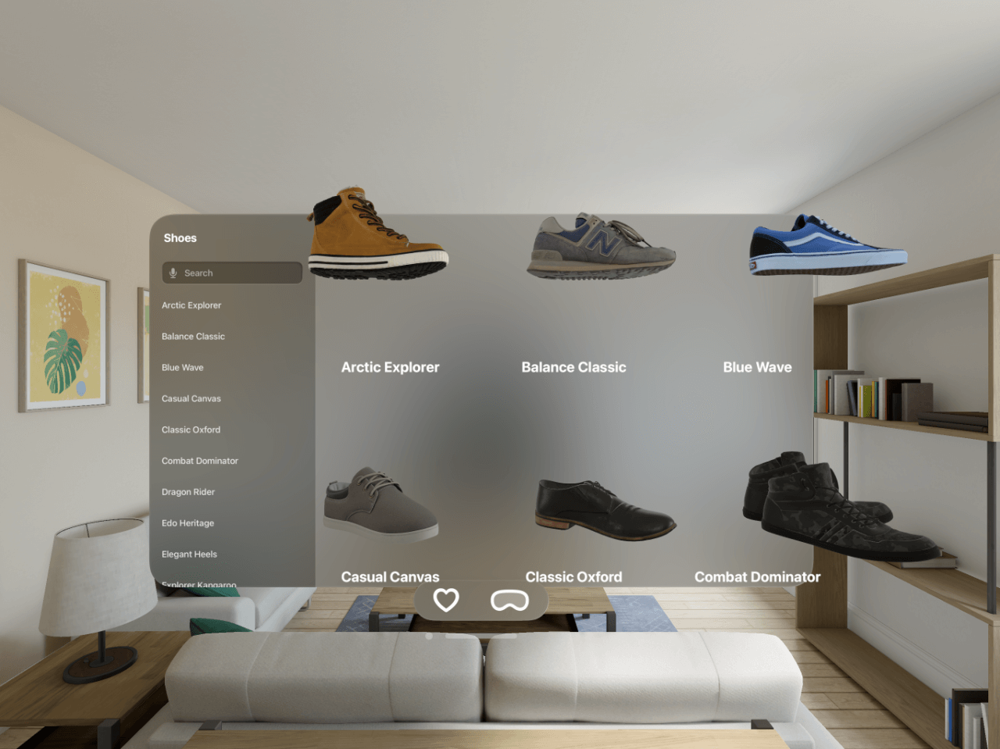
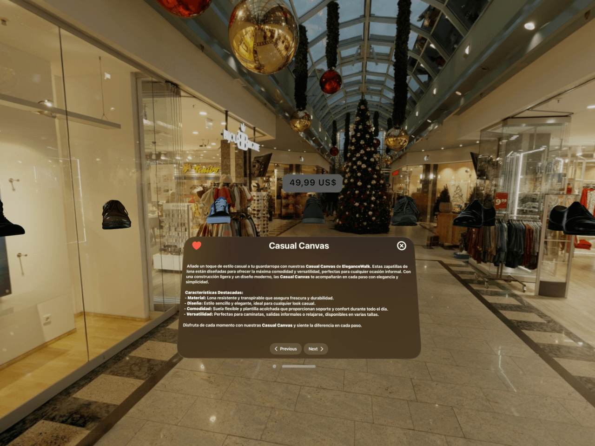
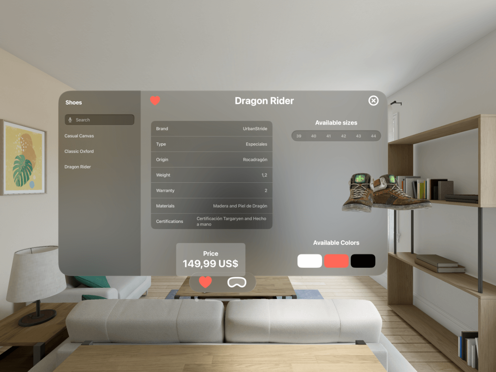

# 👞 Spatial Shoes

## 📄 Descripción

**Spatial Shoes** es una aplicación inmersiva diseñada específicamente para Apple Vision Pro, que ofrece a los usuarios una experiencia única de exploración y selección de zapatos en un entorno virtual. Gracias a la integración de avanzada tecnología de realidad aumentada y las potentes capacidades de Apple Vision Pro, los usuarios pueden visualizar cómo lucirán los zapatos desde diferentes ángulos y en distintas tallas, todo en tiempo real. Además, la aplicación permite explorar detallados modelos en 3D y marcar como favoritos los zapatos que más les gusten para un acceso rápido y fácil.

## ✨ Características

- **Exploración en 3D**: Navega por una colección completa de zapatos en un entorno tridimensional.
- **Entorno inmersivo**: Explora nuestra colección de zapatos en un entorno inmersivo de centro comercial.
- **Experiencia personalizada**: Busca zapatos y obtén información detallada.
- **Guarda tus favoritos**: Añade los zapatos que más te gusten a tu lista de favoritos.
- **Interacción Natural**: Controla la aplicación con gestos intuitivos.

## 🛠️ Requisitos del Sistema

- **Apple Vision Pro** con VisionOS 2.0 o superior.
- **Xcode 16** o superior para desarrollo.
- **Swift 5.10** o superior.
- **SDK de VisionOS**.

## 🚨 Importante: Este Proyecto Contiene Submódulos

Este proyecto incluye un submódulo, que es el proyecto de **Reality Composer Pro**. Asegúrate de clonar el repositorio con la opción `--recurse-submodules` para que todos los archivos del submódulo se descarguen correctamente.

## 📦 Instalación

1. Clona el repositorio incluyendo los submódulos en tu máquina local:

   **Opción 1: Clonar con HTTPS**
    ```bash
    git clone --recurse-submodules https://github.com/jcalderita/spatialshoes-app-vision.git
    ```

   **Opción 2: Clonar con SSH**
    ```bash
    git clone --recurse-submodules git@github.com:jcalderita/spatialshoes-app-vision.git
    ```
2. Abre el proyecto en Xcode:
    ```bash
    cd spatialshoes-app-vision
    open SpatialShoes.xcodeproj
    ```
3. Configura tu entorno de desarrollo seleccionando el dispositivo de Apple Vision Pro como destino.
4. Compila y ejecuta la aplicación en el simulador de Vision Pro o en un dispositivo real.

## 🚀 Uso

- **Navegación**: Utiliza gestos de deslizamiento para moverte por la tienda y realizar busquedas.
- **Prueba Virtual**: Usa el dispositivo Vision Pro para ver cómo lucen los zapatos en un entorno virtual.
- **Favoritos**: Selecciona los zapatos que desees y agrégalos a tu lista de favoritos.

## 📷 Capturas de Pantalla

### Exploración en 3D


### Espacio inmersivo


### Favoritos


## 👥 Contribuciones

Las contribuciones son bienvenidas. Si deseas colaborar en este proyecto, por favor sigue estos pasos:

1. Haz un fork del repositorio.
2. Crea una nueva rama (`git checkout -b feature/nueva-funcionalidad`).
3. Realiza tus cambios y commitea (`git commit -m 'Agrega nueva funcionalidad'`).
4. Sube tus cambios a tu rama (`git push origin feature/nueva-funcionalidad`).
5. Abre un Pull Request y describe las mejoras.

## 📜 Licencia

Este proyecto está licenciado bajo la Licencia Apache 2.0. Para más detalles, revisa el archivo [LICENSE](./LICENSE).

## 📧 Contacto

Si tienes preguntas, sugerencias o comentarios, no dudes en contactar con nosotros a través de ...

[](https://www.linkedin.com/in/jcalderita)

---

¡Gracias por usar Spatial Shoes! Esperamos que disfrutes de la experiencia del futuro de las tiendas en un entorno virtual revolucionario.